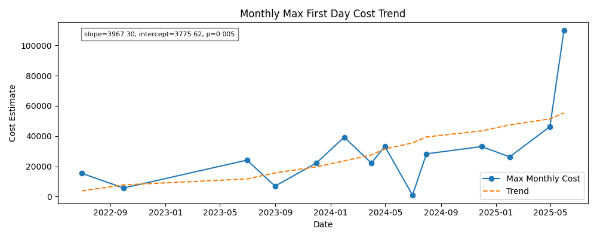
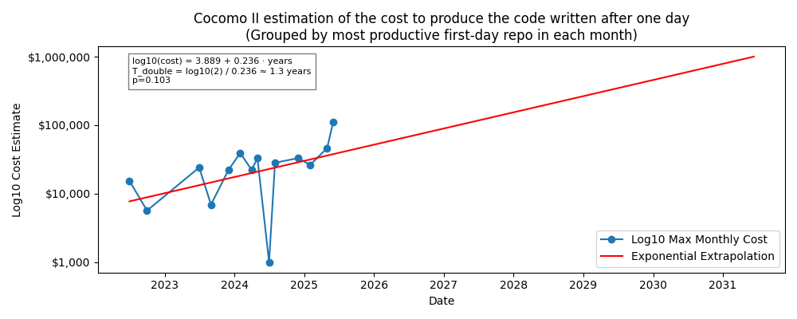
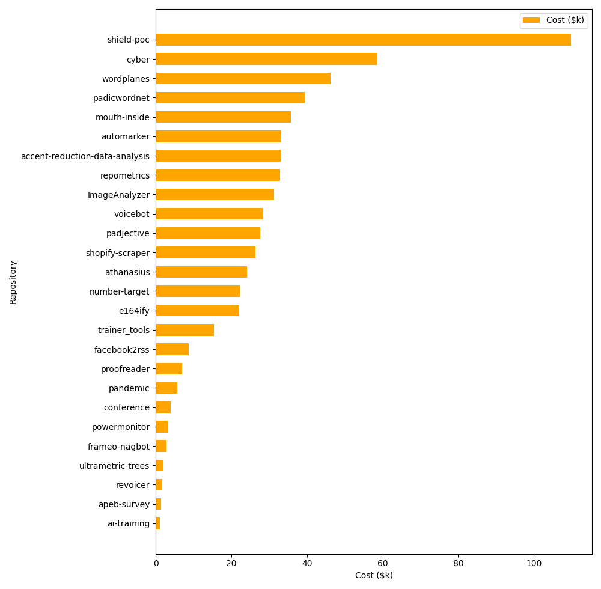

# repometrics
A tool for measuring repository productivity metrics

## Purpose

Repometrics analyzes Git repositories to measure how much code is written during the first day of a project. The tool:

1. Finds all Git repositories in a specified directory (default: ~/devel/)
2. For each repository:
   - Identifies the first commit timestamp
   - Finds the last commit within 24 hours of that first commit
   - Extracts a clean copy of the codebase at that point in time
   - Runs SLOCCount to analyze lines of code and estimated development cost

The results are compiled into a CSV file with each row containing:
- Repository name
- First commit date
- First commit hash
- Last commit hash within the first 24 hours
- Total lines of code
- Estimated development cost (using SLOCCount's COCOMO model)

## Requirements

- Python 3.6+
- Git
- SLOCCount (`apt install sloccount` on Ubuntu)

## Usage

```
uv run firstday.py
```

Results are written to `first_day_analysis.csv` in the current directory. Use `-d` to specify a different directory:

```
uv run firstday.py --directory /path/to/repos
```

You can also change where the CSV file is written with `-o`:

```
uv run firstday.py -d /path/to/repos -o /tmp/output.csv
```

### Repository Skiplist

You can exclude specific repositories from the analysis by creating a `skiplist.txt` file in the same directory as the script. This is useful for repositories that have large initial imports that would skew the results.

Format of `skiplist.txt`:
- One repository name per line
- Lines starting with `#` are treated as comments
- Empty lines are ignored

Example:
```
# Repositories to skip
narrative-learning-nextgen  # Large initial import from another project
imported-project            # Contains pre-existing code
```

If no `skiplist.txt` file is found, a default skiplist containing known problematic repositories is used.

### Recalculating Cost Estimates

The file `first_day_analysis.csv` includes an estimated development cost for
each repository. If you modify the CSV or want to recompute these values, run
`cost_estimator.py`:

```bash
uv run cost_estimator.py
```

This script applies a simple COCOMO-like model and updates the
`cost_estimate` column in place.

## Results

After generating `first_day_analysis.csv`, you can visualize the trends using `generate_trends.py`.
This script relies on external packages, so install them first:

```
uv pip install pandas matplotlib scikit-learn
```

Then run:

```
uv run generate_trends.py
```

The script generates two images in the repository root:

- `cost_trend.png` – maximum first-day cost per month
- `log_cost_trend.png` – the same data plotted on a logarithmic scale

The images are not committed to version control but will appear locally after running the script.

Once generated, the images can be viewed directly on GitHub:





### Barchart by Repository

To compare repositories individually, run `repo_barchart.py`:

```bash
uv run repo_barchart.py
```

This produces `repo_barchart.png`, a horizontal bar chart of the estimated
cost for each repository. The bars are sorted so that the most expensive
projects appear at the top.



### Monthly Top Repositories

To list the highest value repository for each month, run `monthly_top_repo.py`:

```bash
uv run monthly_top_repo.py
```

This prints the repository name, lines of code, and estimated cost for the
largest project each month. Use the `--plot` flag to also generate a scatter
plot of lines of code versus cost for these monthly values:

```bash
uv run monthly_top_repo.py --plot
```

The plot is saved as `loc_vs_cost.png` in the repository root.
